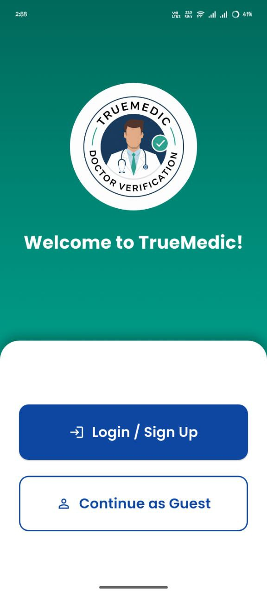
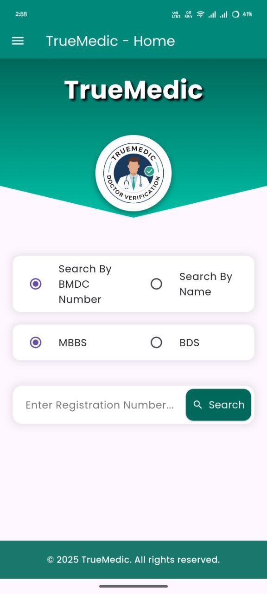
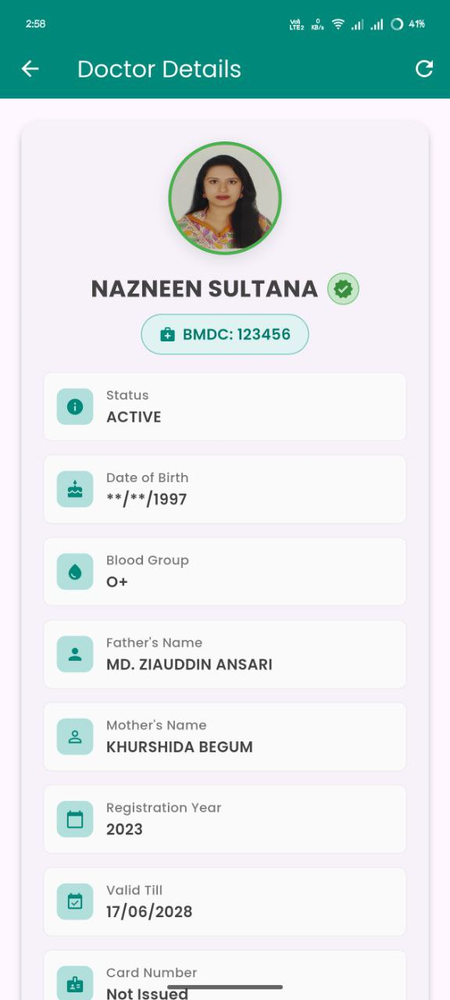

# 🏥 TrueMedic - Doctor Verification Platform

<div align="center">
  
  
  **A comprehensive Flutter application for verifying doctor credentials in Bangladesh**
  
  [](https://flutter.dev)
  [](https://dart.dev)
  [](https://supabase.com)
</div>

---

## 🎯 **Project Motive**

TrueMedic addresses a critical need in Bangladesh's healthcare system by providing a reliable platform to verify doctor credentials. With the increasing concern about medical fraud and fake practitioners, our app ensures patients can trust their healthcare providers.

### 🚀 **Key Problems We Solve:**

- **Medical Fraud Prevention**: Verify authentic BMDC (Bangladesh Medical & Dental Council) registrations
- **Patient Safety**: Ensure patients receive care from licensed professionals
- **Doctor Credibility**: Help legitimate doctors showcase their verified credentials
- **Healthcare Transparency**: Create a trusted ecosystem for medical services

---

## ✨ **Features**

### 👨‍⚕️ **For Doctors**

- **Professional Registration**: Complete profile setup with credentials
- **Document Verification**: Upload and verify medical certificates
- **Dashboard Management**: Manage appointments and patient interactions
- **Status Tracking**: Real-time verification status updates

### 👥 **For Patients/Users**

- **Doctor Search**: Search by BMDC number or doctor name
- **Credential Verification**: Instantly verify doctor authenticity
- **Review System**: Rate and review healthcare experiences
- **Appointment Booking**: Schedule appointments with verified doctors

### 🔍 **Smart Search System**

- **BMBS/BDS Support**: Search for both MBBS and BDS practitioners
- **Real-time Validation**: Instant BMDC number verification
- **Local Database**: Cached results for faster subsequent searches
- **CAPTCHA Security**: Secure API integration with verification

### 👨‍💼 **For Administrators**

- **Verification Management**: Approve/reject doctor applications
- **Analytics Dashboard**: Monitor platform usage and statistics
- **Report Generation**: Comprehensive reporting system
- **User Management**: Oversee platform users and activities

---

## 🛠️ **Tech Stack**

| Category             | Technology                     | Purpose                                 |
| -------------------- | ------------------------------ | --------------------------------------- |
| **Frontend**         | Flutter 3.7.0+                 | Cross-platform mobile app               |
| **Backend**          | Supabase                       | Database, Authentication, Real-time     |
| **External API**     | BMDC Verification API          | Official doctor credential verification |
| **State Management** | Provider + Bloc                | App state management                    |
| **UI/UX**            | Material Design + Google Fonts | Modern, accessible interface            |
| **Authentication**   | Supabase Auth                  | Secure user management                  |
| **Storage**          | Supabase Storage               | Document and image storage              |

---

## 📱 **Screenshots**

<div align="center">
  <table>
    <tr>
      <td align="center"><strong>🔐 Authentication</strong></td>
      <td align="center"><strong>🏠 Home Screen</strong></td>
      <td align="center"><strong>🔍 Doctor Search</strong></td>
    </tr>
    <tr>
      <td></td>
      <td></td>
      <td></td>
    </tr>
  </table>
</div>

---

## 🚀 **Installation Guide**

### 📋 **Prerequisites**

Before you begin, ensure you have the following installed:

- **Flutter SDK** (3.7.0 or higher)
- **Dart SDK** (3.0.0 or higher)
- **Android Studio** or **VS Code** with Flutter extensions
- **Git** for version control

### 🔧 **Step 1: Environment Setup**

#### **Install Flutter**

```bash
# Windows (using Git)
git clone https://github.com/flutter/flutter.git -b stable
export PATH="$PATH:`pwd`/flutter/bin"

# macOS (using Homebrew)
brew install flutter

# Verify installation
flutter doctor
```

#### **Install Dependencies**

```bash
# Android SDK (via Android Studio)
# Download and install Android Studio
# Install Android SDK and accept licenses
flutter doctor --android-licenses
```

### 📥 **Step 2: Clone Repository**

```bash
# Clone the repository
git clone https://github.com/Tertho1/truemedic.git
cd truemedic

# Navigate to Flutter project
cd truemedic
```

### 📦 **Step 3: Install Dependencies**

```bash
# Get Flutter dependencies
flutter pub get

# For iOS (if applicable)
cd ios && pod install && cd ..
```

### ⚙️ **Step 4: Configuration**

#### **Supabase Setup**

1. Create a Supabase project at [supabase.com](https://supabase.com)
2. Copy your project URL and anon key
3. Update `lib/main.dart`:

```dart
await Supabase.initialize(
  url: 'YOUR_SUPABASE_URL',
  anonKey: 'YOUR_SUPABASE_ANON_KEY',
);
```

#### **Android Configuration**

1. Update `android/app/src/main/AndroidManifest.xml`:

```xml
<uses-permission android:name="android.permission.INTERNET" />
<uses-permission android:name="android.permission.ACCESS_NETWORK_STATE" />
```

### 🏃‍♂️ **Step 5: Run the Application**

```bash
# Check connected devices
flutter devices

# Run on connected device/emulator
flutter run

# For specific platform
flutter run -d android    # Android
flutter run -d ios        # iOS
flutter run -d chrome     # Web
```

### 📱 **Step 6: Build for Production**

#### **Android APK**

```bash
# Build release APK
flutter build apk --release

# Build App Bundle (recommended for Play Store)
flutter build appbundle --release
```

#### **iOS (macOS only)**

```bash
# Build for iOS
flutter build ios --release
```

---

## 🏗️ **Project Structure**

```
truemedic/
├── 📁 lib/
│   ├── 📁 main.dart                 # App entry point
│   ├── 📁 models/                   # Data models
│   ├── 📁 screens/                  # UI screens
│   │   ├── 📁 auth/                 # Authentication screens
│   │   ├── 📁 home/                 # Home and dashboard screens
│   │   ├── 📁 admin/                # Admin panel screens
│   │   └── 📁 reviews/              # Review system screens
│   ├── 📁 services/                 # API and business logic
│   ├── 📁 widgets/                  # Reusable UI components
│   └── 📁 utils/                    # Helper functions
├── 📁 assets/                       # Images and static files
├── 📁 android/                      # Android-specific files
├── 📁 ios/                          # iOS-specific files
└── 📄 pubspec.yaml                  # Dependencies and metadata
```

---

## 🔧 **Configuration Files**

### **Environment Variables**

Create a `.env` file in the root directory:

```env
SUPABASE_URL=your_supabase_url
SUPABASE_ANON_KEY=your_supabase_anon_key
BMDC_API_URL=https://tm-api-zeta.vercel.app
```

### **Supabase Database Schema**

```sql
-- Users table
CREATE TABLE users (
  id UUID PRIMARY KEY DEFAULT gen_random_uuid(),
  email TEXT UNIQUE NOT NULL,
  role TEXT DEFAULT 'user',
  created_at TIMESTAMP DEFAULT NOW()
);

-- Doctors table
CREATE TABLE doctors (
  id UUID PRIMARY KEY REFERENCES auth.users(id),
  bmdc_number TEXT UNIQUE,
  full_name TEXT,
  specialization TEXT,
  verification_status TEXT DEFAULT 'pending',
  created_at TIMESTAMP DEFAULT NOW()
);

-- MBBS Doctors table
CREATE TABLE mbbs_doctors (
  bmdc_number TEXT PRIMARY KEY,
  full_name TEXT,
  father_name TEXT,
  mother_name TEXT,
  blood_group TEXT,
  birth_year TEXT,
  reg_year TEXT,
  valid_till TEXT,
  status TEXT,
  image_base64 TEXT
);

-- BDS Doctors table
CREATE TABLE bds_doctors (
  bmdc_number TEXT PRIMARY KEY,
  full_name TEXT,
  father_name TEXT,
  mother_name TEXT,
  blood_group TEXT,
  birth_year TEXT,
  reg_year TEXT,
  valid_till TEXT,
  status TEXT,
  image_base64 TEXT
);
```

---

## 🔍 **API Integration**

The app integrates with multiple APIs:

### **BMDC Verification API**

- **Endpoint**: `https://tm-api-zeta.vercel.app`
- **Purpose**: Official doctor credential verification
- **Features**: CAPTCHA protection, session management

### **Supabase API**

- **Authentication**: User registration and login
- **Database**: Store and retrieve doctor/user data
- **Real-time**: Live updates and notifications

---

## 🧪 **Testing**

```bash
# Run unit tests
flutter test

# Run integration tests
flutter test integration_test/

# Generate coverage report
flutter test --coverage
```

---

## 🚀 **Deployment**

### **Android Play Store**

1. Build signed APK/App Bundle
2. Upload to Google Play Console
3. Complete store listing
4. Submit for review

### **iOS App Store**

1. Build for iOS
2. Upload via Xcode or Application Loader
3. Complete App Store Connect listing
4. Submit for review

---

## 📊 **Performance & Analytics**

- **App Size**: ~50MB (optimized)
- **Load Time**: <3 seconds on average devices
- **Offline Support**: Cached doctor data available offline
- **Cross-Platform**: iOS, Android, and Web support

---

## 🤝 **Contributing**

We welcome contributions! Please follow these steps:

1. **Fork** the repository
2. **Create** a feature branch (`git checkout -b feature/amazing-feature`)
3. **Commit** your changes (`git commit -m 'Add amazing feature'`)
4. **Push** to the branch (`git push origin feature/amazing-feature`)
5. **Open** a Pull Request

### **Development Guidelines**

- Follow Flutter best practices
- Write comprehensive tests
- Update documentation
- Ensure code formatting (`flutter format .`)

---

## 🐛 **Troubleshooting**

### **Common Issues**

#### **Network Error on Android**

```bash
# Add to AndroidManifest.xml
<uses-permission android:name="android.permission.INTERNET" />
```

#### **Supabase Connection Issues**

```dart
// Check your Supabase configuration
print('Supabase URL: ${Supabase.instance.client.supabaseUrl}');
```

#### **Build Errors**

```bash
# Clean and rebuild
flutter clean
flutter pub get
flutter run
```

---

## 📞 **Support & Contact**

- **Email**: support@truemedic.app
- **Website**: [www.truemedic.app](https://truemedic.app)
- **Documentation**: [docs.truemedic.app](https://docs.truemedic.app)
- **Issues**: [GitHub Issues](https://github.com/yourusername/truemedic/issues)

---

## 📄 **License**

This project is licensed under the MIT License - see the [LICENSE](LICENSE) file for details.

---

## 🙏 **Acknowledgments**

- **Bangladesh Medical & Dental Council (BMDC)** for credential verification API
- **Supabase** for backend infrastructure
- **Flutter Team** for the amazing framework
- **Open Source Community** for valuable packages and contributions

---

<div align="center">
  <h3>🌟 Star this repository if you find it helpful! 🌟</h3>
  
  **Made with ❤️ for Bangladesh Healthcare System**
  
  **TrueMedic Team © 2025**
</div>
